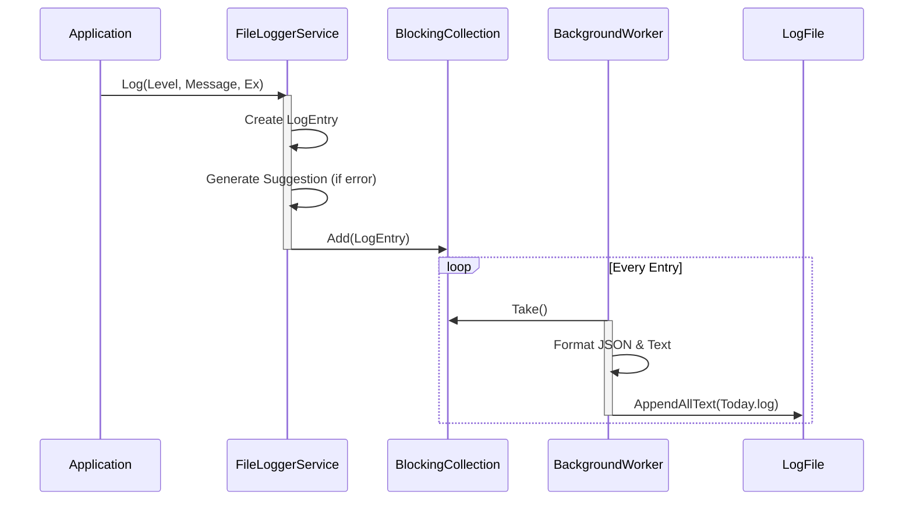

# Logging Sequence Diagram

```mermaid
sequenceDiagram
    participant App as Application
    participant Logger as FileLoggerService
    participant Queue as BlockingCollection
    participant Worker as BackgroundWorker
    participant File as LogFile

    App->>Logger: Log(Level, Message, Ex)
    activate Logger
    Logger->>Logger: Create LogEntry
    Logger->>Logger: Generate Suggestion (if error)
    Logger->>Queue: Add(LogEntry)
    deactivate Logger

    loop Every Entry
        Worker->>Queue: Take()
        activate Worker
        Worker->>Worker: Format JSON & Text
        Worker->>File: AppendAllText(Today.log)
        deactivate Worker
    end
```
