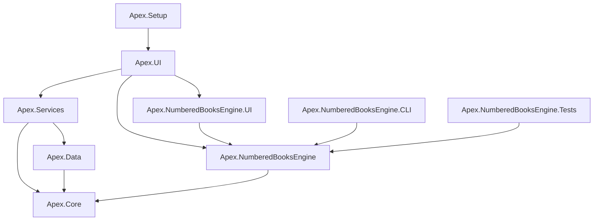

# توثيق بنية المشروع - Apex Printing System

## نظرة عامة على المشاريع

هذا الملف يوضح الغرض من كل مشروع في الحل ودوره في النظام.

---

## المشاريع الرئيسية

### 1. Apex.Core
**الموقع:** `Apex.PrintingSystem\Apex.Core`  
**النوع:** Class Library  
**الوصف:** المكونات الأساسية المشتركة بين جميع المشاريع

**المحتويات:**
- Models أساسية مشتركة
- Interfaces عامة
- Constants وEnumerations
- Extension Methods
- Utility Classes

**الاستخدام:**
```csharp
// يُستخدم في جميع المشاريع الأخرى
using Apex.Core;
using Apex.Core.Models;
```

---

### 2. Apex.Data
**الموقع:** `Apex.PrintingSystem\Apex.Data`  
**النوع:** Class Library  
**الوصف:** طبقة الوصول للبيانات (Data Access Layer)

**المحتويات:**
- `ApexDbContext.cs` - Entity Framework Context
- `Entities/` - Database Models
  - `Printer.cs`
  - `PrintJob.cs`
  - `SystemSettings.cs`
  - `SavedQueue.cs`
  - `RoutingRule.cs`
  - `PrinterPool.cs`
- `Repositories/` - Repository Pattern
- `Migrations/` - Auto-Migration System
  - `AutoMigrationService.cs`
  - `SchemaComparer.cs`
  - `MigrationPlanner.cs`

**التبعيات:**
```
├── Microsoft.EntityFrameworkCore 8.0
├── Microsoft.EntityFrameworkCore.Sqlite 8.0
└── Apex.Core
```

**الميزات:**
- ✅ Auto-migration على بدء التشغيل
- ✅ Repository pattern
- ✅ SQLite database
- ✅ Schema versioning

---

### 3. Apex.Services
**الموقع:** `Apex.PrintingSystem\Apex.Services`  
**النوع:** Class Library  
**الوصف:** منطق الأعمال (Business Logic Layer)

**المحتويات:**
- `PrinterService.cs` - إدارة الطابعات
- `PrintJobService.cs` - إدارة مهام الطباعة
- `DistributionService.cs` - توزيع المهام
- `RoutingService.cs` - توجيه الطباعة
- `SettingsService.cs` - إدارة الإعدادات
- `DatabaseHealthService.cs` - صحة قاعدة البيانات

**التبعيات:**
```
├── Apex.Core
└── Apex.Data
```

**الأنماط المستخدمة:**
- Service Layer Pattern
- Dependency Injection
- Async/Await

---

### 4. Apex.UI
**الموقع:** `Apex.PrintingSystem\Apex.UI`  
**النوع:** WPF Application  
**الوصف:** الواجهة الرئيسية للتطبيق

**البنية:**
```
Apex.UI/
├── ViewModels/          # 14 ViewModel
├── Views/               # 33 View (XAML)
├── Resources/           
│   ├── Language.ar.xaml # اللغة العربية
│   └── Language.en.xaml # اللغة الإنجليزية
├── Styles/
│   ├── Theme.xaml
│   ├── Colors.xaml
│   ├── Controls.xaml
│   ├── Animations.xaml
│   └── ModernEffects.xaml
├── Converters/          # Value Converters
├── Services/
│   ├── DialogService.cs
│   └── LocalizationService.cs
└── Modules/             # DI Registration
    ├── DataModule.cs
    ├── ServicesModule.cs
    └── UIModule.cs
```

**ViewModels:**
1. `DashboardViewModel` - لوحة التحكم
2. `PrintersViewModel` - إدارة الطابعات
3. `PrintManagerViewModel` - مدير الطباعة
4. `PrintOperationsViewModel` - عمليات الطباعة
5. `BatchPrintViewModel` - الطباعة الكمية
6. `NumberedBooksViewModel` - الكتب المرقمة
7. `NumberingWizardViewModel` - معالج الترقيم
8. `DistributionViewModel` - التوزيع
9. `QuotationViewModel` - عروض الأسعار
10. `SettingsViewModel` - الإعدادات
11. `PrinterDiagnosticsViewModel` - التشخيصات
12. `SystemPerformanceViewModel` - الأداء
13. `LogViewerViewModel` - السجلات
14. `FreeFormEditorViewModel` - المحرر الحر

**التبعيات الرئيسية:**
```xml
<PackageReference Include="CommunityToolkit.Mvvm" Version="8.4.0" />
<PackageReference Include="LiveChartsCore.SkiaSharpView.WPF" Version="2.0.0-rc2" />
<PackageReference Include="Microsoft.Extensions.DependencyInjection" Version="8.0.0" />
<PackageReference Include="Serilog" Version="4.3.0" />
```

---

### 5. Apex.NumberedBooksEngine
**الموقع:** `Apex.PrintingSystem\Apex.NumberedBooksEngine`  
**النوع:** Class Library  
**الوصف:** محرك معالجة الكتب المرقمة

**الوظائف:**
- تصميم صفحات الكتب المرقمة
- إدارة أرقام التسلسل
- دعم Multi-Copy Numbering
- تطبيق الأنماط والتنسيقات
- PDF Generation

**المكونات الرئيسية:**
- `Composer.cs` - تركيب الصفحات
- `NumberingEngine.cs` - محرك الترقيم
- `StyleManager.cs` - إدارة الأنماط
- `PageGenerator.cs` - توليد الصفحات

---

### 6. Apex.NumberedBooksEngine.UI
**الموقع:** `Apex.PrintingSystem\Apex.NumberedBooksEngine.UI`  
**النوع:** WPF Control Library  
**الوصف:** واجهة المستخدم لمحرك الكتب المرقمة

**المحتويات:**
- عناصر WPF قابلة لإعادة الاستخدام
- معاينات حية (Live Previews)
- أدوات التصميم (Design Tools)
- Canvas للتعديل

---

### 7. Apex.NumberedBooksEngine.CLI
**الموقع:** `Apex.PrintingSystem\Apex.NumberedBooksEngine.CLI`  
**النوع:** Console Application  
**الوصف:** واجهة سطر الأوامر للمعالجة الدُفعية

**الاستخدام:**
```bash
Apex.NumberedBooksEngine.CLI.exe --input book.pdf --start 1 --end 1000 --output numbered.pdf
```

**الحالات:**
- ✅ Batch processing
- ✅ Automation
- ✅ Server-side processing
- ✅ CI/CD integration

---

### 8. Apex.NumberedBooksEngine.Tests
**الموقع:** `Apex.PrintingSystem\Apex.NumberedBooksEngine.Tests`  
**النوع:** Test Project  
**الوصف:** اختبارات وحدة المحرك

**الإطار:** xUnit / NUnit  
**التغطية:** Unit Tests & Integration Tests

---

### 9. Apex.Setup / Apex.Installer
**الموقع:** `Apex.PrintingSystem\Apex.Setup`  
**النوع:** Setup Project  
**الوصف:** مشروع إنشاء برنامج التثبيت

**الأدوات:**
- Inno Setup
- WiX Toolset (optional)

**المخرجات:**
- `ApexPrintingSystemSetup.exe`
- MSI installer (optional)

---

## 🗑️ المشاريع القديمة (Legacy)

هذه المشاريع موجودة في المجلد الجذر (`d:\Apex\system\`) وهي **غير مستخدمة**:

### ⚠️ Apex.Core (Root)
**الحالة:** 🔴 قديم - غير مستخدم  
**المحتوى:** Class1.cs placeholder فقط  
**الإجراء الموصى به:** احتفظ به للتوافق أو احذفه

### ⚠️ Apex.Data (Root)
**الحالة:** 🔴 قديم - غير مستخدم  
**المحتوى:** Class1.cs placeholder فقط  
**الإجراء الموصى به:** احتفظ به للتوافق أو احذفه

### ⚠️ Apex.Services (Root)
**الحالة:** 🔴 قديم - غير مستخدم  
**المحتوى:** Class1.cs placeholder فقط  
**الإجراء الموصى به:** احتفظ به للتوافق أو احذفه

### ⚠️ Apex.UI (Root)
**الحالة:** 🔴 قديم - غير مستخدم  
**المحتوى:** ملفات WPF بسيطة  
**الإجراء الموصى به:** احتفظ به للتوافق أو احذفه

> **ملاحظة:** هذه المشاريع كانت على الأرجح نماذج أولية (prototypes) أو نقطة بداية المشروع قبل إعادة الهيكلة.

---

## 🔗 مخطط التبعيات



---

## 📊 إحصائيات البنية

| المقياس | القيمة |
|---------|--------|
| إجمالي المشاريع | 9 (نشطة) + 4 (قديمة) |
| إجمالي ViewModels | 14+ |
| إجمالي Views | 33+ |
| اللغات المدعومة | 2 (عربي/إنجليزي) |
| أنماط المعمارية | MVVM, Repository, DI |

---

## 🎯 التوصيات

### للمطورين الجدد
1. ابدأ بفهم `Apex.Core` - المكونات الأساسية
2. راجع `Apex.Data` - نماذج البيانات
3. افحص `Apex.Services` - منطق الأعمال
4. تعلم `Apex.UI` - ViewModels & Views

### للصيانة
1. ✅ احذف المشاريع القديمة في الجذر (أو وثّقها بوضوح)
2. ✅ أضف Unit Tests لـ Apex.Services
3. ✅ حسّن التحذيرات في Apex.UI.csproj
4. ✅ أنشئ documentation للـ API

---

## 🔄 التحديثات المستقبلية

- [ ] ترحيل إلى .NET 9.0
- [ ] إضافة Blazor UI (اختياري)
- [ ] REST API Layer
- [ ] Docker support
- [ ] Microservices architecture (مستقبلي)

---

> **آخر تحديث:** 11 ديسمبر 2025  
> **المسؤول:** Apex Development Team
